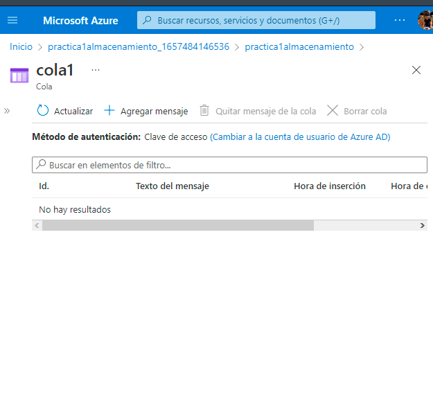
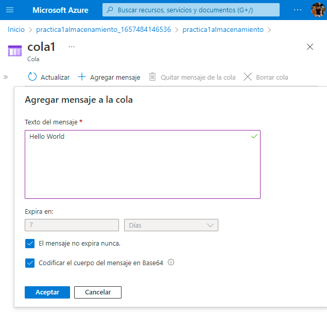

# Practica 3Sesion 6
Implementación del servicio de colas para Azure.

Este es un servicio muy simple para generar mensajes de manera automática por ejemplo. El primero paso es ir al apartado de colas y crear un recurso.

Finalmente colocamos el mensaje deseada entre otras especificaciones y ya tendríamos nuestro mensaje creado.

---
Autor: Rogelio Clemente Balderas

Fecha: 10/07/2022

Requisitos:
- Azure Storage
- Colas